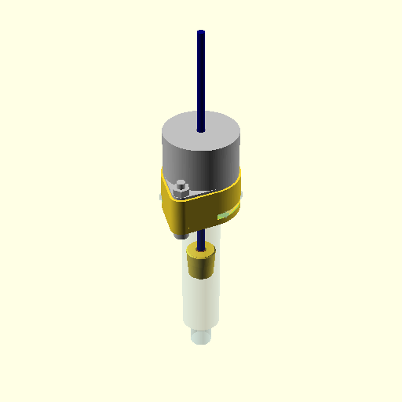

# Shenzhen style

 

A 10cc glue dispenser. Designed to have a low number of pieces. Simple to solder, and easy to assemble. Plungers for [10cc Chinese generic](https://www.google.com/search?q=10cc+Glue+Adhesive+Dispenser+Industrial+Syringe+Tube+Set+for+Industrial+Dispensing) , and 10cc Nordson. Adapter for CNC 3018.

Cutout view of the assembled dispenser: [3D assembly view](stl/assembly.stl)

## Bill of Materials
### 3D-Printed
Workpieces printed in ABS using FDM:

- [body](stl/body.stl)
- [syringe holder](stl/syringe_holder.stl)
- [adapter for cnc 3018](stl/cnc3018_adapter.stl)
- [plunger](stl/plunger.stl)
- [insert_practice](stl/insert_practice.stl)

Leave part orientation as is when imported into PrusaSlicer. Designed to print without support.

### Dispenser

Quantity|Item
--------|----
1|[Robotdigg NC35-BYZ-120](https://www.robotdigg.com/product/1147/12V-35-captive-or-non-captive-linear-pm-stepper-motor) non-captive linear stepper, 7.5°/step
1|[M3 x 5.0mm O.D. x 6.0mm L threaded knurled brass insert](https://www.aliexpress.com/item/4000232858343.html)
2|[M4x25mm screw](https://www.aliexpress.com/item/4000197066058.html)
2|[M4 nut](https://www.aliexpress.com/item/32959149109.html)

Of course, you'll also need syringes. Some products, such as [Mechanic brand solder paste](https://www.google.com/search?q=Mechanic+XG-Z40+10cc+Syringe+Solder+Paste+Flux+Paste+Sn63%2FPb37), are sold in syringes, Luer needle included, ready to use. Or you can buy empty [10cc industrial glue dispenser syringes](https://www.aliexpress.com/item/33025919381.html) and fill them yourself.

## Assembly
- Set your soldering iron to the filament extrusion temperature used during 3D printing, about 255°C for ABS.
- As a test, take the workpiece [insert_practice](stl/insert_practice.stl) and place 4 heat-set inserts. 
- Put an M3 threaded brass insert in the [plunger](stl/plunger.stl).
- Screw the plunger on the stepper motor shaft.
### Hand-held
For the hand-held dispenser:
- Put the syringe in the [syringe holder](stl/syringe_holder.stl)
- Join stepper motor, [body](stl/body.stl), and syringe holder with the M4x25 screws.
- Connect the glue dispenser stepper motor to the controller board.

### CNC 3018 adapter
For the dispenser mounted in a CNC 3018:
- Put the syringe in the [adapter for cnc 3018](stl/cnc3018_adapter.stl).
- Join stepper motor, [body](stl/body.stl), and cnc 3018 adapter with the M4x25 screws.
- Put the dispenser in the CNC 3018 z-carriage. The dispenser has the same diameter as the router spindle, 42mm. Tighten the screws of the z-carriage very lightly, or not at all.
- Connect the glue dispenser stepper to the 3d-printer controller extruder (E0/E1).
- Dispensing glue is done by printing a g-code file, like a 3d printer.

## Controller
The controller is only needed if you wish to use the glue dispenser as a stand-alone, hand-held device. 

[Schematic and board layout at easyeda](http://easyeda.com/koendv/stepper-controller).

Quantity|Item
--------|----
1|[PCB](https://jlcpcb.com/)
1|[STM32F103C8T6 Blue Pill](http://www.aliexpress.com/item/32981849126.html)
1|[TMC2130 Silent Stepstick](https://www.aliexpress.com/item/32970150483.html)
1|[Mini dc-dc converter 24V to 5v](https://www.aliexpress.com/item/32796268715.html)
1|[0.96inch 128X64 I2C SSD1306 OLED WHITE/BLUE](https://www.aliexpress.com/item/32830523451.html)
1|[EC11 Rotary Encoder with Button](https://www.aliexpress.com/item/32915420023.html)
1|[3.5mm headphone jack](https://www.aliexpress.com/item/4000309078079.html)
1|[DC005 DC Power Jack 5.5mm dia, 2.5mm pin](https://www.aliexpress.com/item/4000034340966.html)
2|Pushbutton 6x6mm
1|Capacitor 47u/50V
1|4-Pin Male header (Dupont or JST XH-4AK)

*This is Work In Progress.*
